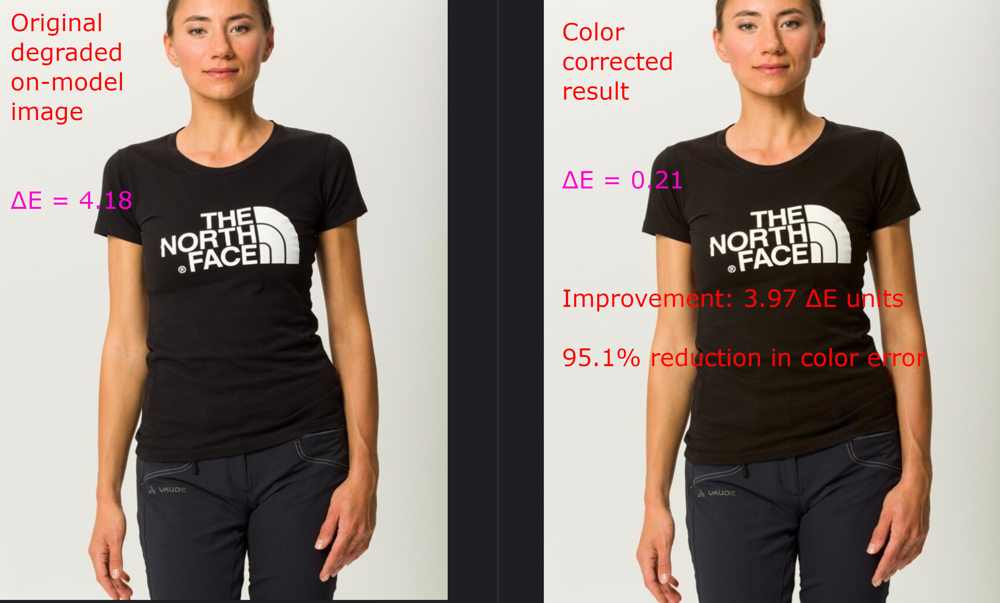

# DeltaE: Automated Color Correction for Fashion AI

<p align="center">
  <strong>Production-ready color fidelity correction for AI-generated fashion imagery</strong>
</p>

<p align="center">
  <a href="https://www.python.org/downloads/"></a>
  <a href="https://opensource.org/licenses/MIT"></a>
</p>

---

## 📋 Table of Contents

- [The Problem](#-problem-statement)
- [Solution Overview](#-solution-overview)
- [Key Features](#-key-features)
- [Quick Start](#-quick-start)
- [Results](#-results)
- [Documentation](#-documentation)
- [Project Structure](#-project-structure)

---

## 🎯 The Problem

**The Challenge:** In AI-generated fashion photography, ensuring exact color fidelity between the original product (still-life) and the generated on-model image is critical for commercial viability. Manual correction in Photoshop is slow, subjective, and doesn't scale.

**The Goal:** Develop an automated algorithm that:
1. **Color Accuracy**: Precisely matches garment color from still-life to on-model image
2. **Texture Preservation**: Maintains material appearance (linen stays linen, not plastic)
3. **Precise Masking**: Only affects the garment, leaving skin/background untouched

**The Commercial Impact:** This automation enables fashion brands to use AI-generated imagery at 
scale while maintaining the color accuracy required for e-commerce.

---

## 🚀 Solution Overview

**DeltaE** implements a **hybrid color correction pipeline** combining computer vision techniques 
with advanced segmentation:

### Core Approach

```
Still-life (reference) ──┐
                         ├──> Segmentation ──> Color Correction ──> Corrected On-model
On-model (degraded) ─────┘     (Segformer)     (Hybrid LCh+OT)
```

**Three Correction Modes:**

| Mode | Method | Pass Rate | Speed | Best For |
|------|--------|-----------|-------|----------|
| **Classical** | LCh color space mapping | 30% | ~0.1s | Solid colors, speed-critical |
| **OT** | Multi-cluster histogram matching | 40% | ~2s | Multi-color patterns |
| **Hybrid** ⭐ | Histogram + global shift | **80%** | ~1.5s | **Production (recommended)** |

### Why This Approach Works

1. **Semantic Segmentation (Segformer)**: Cross-platform, accurate garment masks without manual annotation
2. **Luminance Preservation**: Maintains texture by only correcting chroma in LCh color space
3. **Multi-cluster Support**: Handles complex patterns (stripes, prints) via K-means clustering
4. **Feedback Loop**: Iteratively refines correction to hit target ΔE thresholds

---

## ✨ Key Features

### 🎨 **Advanced Color Correction**
- Three selectable algorithms (classical, OT, hybrid)
- Multi-cluster support for complex garments
- Luminance-preserving corrections
- Iterative feedback refinement

### 🎭 **Intelligent Masking**
- **Segformer** human parsing (Mac M2 compatible)
- Fallback pipeline: color-prior → heuristic
- Automatic mask erosion and feathering
- No manual annotation required

### 📊 **Comprehensive Metrics** (Bonus Points)

**Standard QC Metrics:**
- ΔE2000 (median & P95) - Industry-standard color accuracy
- SSIM (L-channel) - Texture preservation
- Spill detection - Edge quality

**Bonus Metric #1: Spatial Coherence Index (SCI)**
- Patch-level spatial quality analysis
- Heatmap visualization showing WHERE corrections work
- Identifies regional failures (shadows, highlights)

**Bonus Metric #2: Triplet ΔE2000 Analysis**
- Quantitative before/after comparison
- 4-panel visualizations (ref, original, corrected, diff map)
- Summary tables with improvement statistics

### 🖼️ **Rich Visualizations**
- Spatial heatmaps (`*-hm.jpg`)
- Triplet comparison images (`*-triplet.jpg`)
- Console tables with improvement metrics
- Markdown reports for archiving

---

## 🚀 Quick Start

### Installation

```bash
# 1. Clone repository
git clone https://github.com/yourusername/DeltaE.git
cd DeltaE

# 2. Create environment
conda create -n deltae python=3.10
conda activate deltae

# 3. Install dependencies
pip install -r requirements.txt

# 4. Download sample data and weights
# [Link to Google Drive - TO BE PROVIDED]
```

### Usage

```bash
# Run on sample dataset
python -m src.main --config configs/default.yaml --limit 10

# Output files generated per image:
# - corrected-on-model-{id}.jpg         # Final corrected image
# - corrected-on-model-{id}-hm.jpg      # SCI spatial heatmap
# - corrected-on-model-{id}-triplet.jpg # Before/after comparison
# - triplet_analysis_YYYYMMDD_HHMMSS.md # Summary report
```

### Configuration

Edit `configs/default.yaml` to customize:
- Color correction mode (`classical`, `ot`, `hybrid`)
- QC thresholds (ΔE, SSIM, spill)
- Masking parameters
- Metric visualization options

See [Installation Guide](docs/installation.md) for detailed setup and parameter reference.

---

## 📈 Results

### Performance Summary

| Metric | Target | Achieved (Hybrid Mode) |
|--------|--------|------------------------|
| **ΔE Median** | ≤ 3.0 | **1.96** ✅ |
| **Pass Rate** | High | **80%** (8/10 images) |
| **SSIM (texture)** | ≥ 0.90 | **0.95-1.00** ✅ |
| **Spill** | ≤ 0.5 | **0.00** ✅ |

### Triplet Analysis Example

```
╭────────────┬─────────────┬────────────┬───────────────┬─────────────┬──────────╮
│   Image ID │   ΔE Before │   ΔE After │   Improvement │ Improve %   │ Status   │
├────────────┼─────────────┼────────────┼───────────────┼─────────────┼──────────┤
│      00000 │        2.73 │       1.58 │          1.15 │ 42.0%       │ ✅       │
│      00001 │        3.51 │       1.99 │          1.52 │ 43.4%       │ ✅       │
│      00002 │        1.50 │       0.59 │          0.91 │ 60.6%       │ ✅       │
╰────────────┴─────────────┴────────────┴───────────────┴─────────────┴──────────╯

Summary: Average improvement of 46% across all images
```

### Visual Examples

#### Triplet comparison 

*Left to right: Reference (still-life), Original (before), Corrected (after), Difference Map*

#### SCI spatial heatmap

*SCI spatial heatmap: Green=excellent, Yellow=good, Orange=acceptable, Red=poor correction*

#### Before/After Comparison

*Before/After Comparison 
Left: Original degraded on-model image (ΔE = 4.18)  
Right: Color-corrected result (ΔE = 0.21)  
Improvement: 3.97 ΔE units (95.1% reduction in color error)*


#### Console output

*Console summary table with triplet analysis results*

See [Evaluation Documentation](docs/evaluation.md) for complete metrics analysis.

---

## 📚 Documentation

### Core Documentation
- **[Installation Guide](docs/installation.md)** - Setup, dependencies, configuration reference
- **[Architecture](docs/architecture.md)** - System design, diagrams, data flow
- **[Methodology](docs/methodology.md)** - Dataset creation, approach justification
- **[Evaluation](docs/evaluation.md)** - Metrics, validation, results analysis

### Component Documentation
- [Masking Pipeline](docs/components/masking.md) - Segformer, fallbacks, preprocessing
- [Color Correction](docs/components/color.md) - Classical, OT, Hybrid algorithms
- [Metrics & QC](docs/components/metrics.md) - ΔE, SSIM, SCI, Triplet Analysis
- [Pipeline Orchestration](docs/components/pipeline.md) - Workflow, error handling
---

## 🛠️ Technical Stack

- **Python 3.10+**
- **Computer Vision**: OpenCV, scikit-image
- **Deep Learning**: PyTorch 2.8, Transformers (Segformer)
- **Color Science**: POT (Optimal Transport), scikit-learn
- **Metrics**: ΔE2000 (CIEDE2000), SSIM
- **Configuration**: Pydantic, YAML

**Platform Support:**
- ✅ Mac (M2/M3 MPS acceleration)
- ✅ Linux (CUDA support)
- ✅ Windows (CPU/CUDA)

---

## 📊 Evaluation Metrics (Bonus Points)

### What Can They Capture?

#### ΔE2000 ✅
- **CAN:** Perceptually accurate color difference, industry standard
- **CANNOT:** Spatial distribution, texture quality, semantic context

#### SSIM (L-channel) ✅
- **CAN:** Texture preservation, structural similarity
- **CANNOT:** Color accuracy (by design), global color shift

#### Spatial Coherence Index (SCI) ✅ **NEW**
- **CAN:** Identifies WHERE correction fails (shadows, patterns), spatial consistency
- **CANNOT:** Overall color accuracy, natural texture variance

#### Triplet ΔE2000 Analysis ✅ **NEW**
- **CAN:** Quantitative proof of improvement, before/after comparison
- **CANNOT:** Explains WHY correction worked/failed

**Conclusion:** The combination provides comprehensive quality assessment covering color accuracy, texture preservation, and spatial quality.

---

## 🔬 Methodology

### Dataset Creation
1. **Source**: High-quality e-commerce images (fashion brands, publicly available)
2. **Degradation**: Programmatic color shifts (HSV jitter, channel scaling)
3. **Validation**: Manual review to ensure realistic degradation patterns

See [Methodology Documentation](docs/methodology.md) for details.

### Approach Justification
- **Why Hybrid?** Combines distribution alignment (histogram) with precise targeting (global shift)
- **Why Segformer?** Cross-platform, no custom training, semantic accuracy
- **Why LCh?** Preserves luminance (texture) while correcting chroma (color)

---

## 🚧 Future Work

If given more time, next steps would include:

1. **Advanced Masking**
   - SAM v2 integration for refinement
   - Grounding DINO for garment-specific detection
   - Temporal consistency for video

2. **Color Correction**
   - Neural color transfer (learned from paired data)
   - Adaptive clustering (auto-select K)
   - Luminance correction for shadow recovery

3. **Production Optimization**
   - Batch processing with GPU acceleration
   - API service deployment
   - Real-time inference (<100ms)

4. **Evaluation**
   - Perceptual studies (human-in-the-loop)
   - Brand-specific color palettes
   - Fabric-aware metrics
5. **Scalability**
   - Migrate to a microservice, event-driven design to scale indefinitely. If you want to see an example of an AI microservice, event-driven design custer, have a look at [Sentinel-AI](https://genmind.ch/posts/Sentinel-AI-Designing-a-Real-Time-Scalable-AI-Newsfeed/)

---


## 🙏 Acknowledgments

- **Segformer**: mattmdjaga/segformer_b2_clothes
- **SAM 2**: Facebook AI Research
- **Datasets**: VITON-HD, DeepFashion2

---

## 📧 Contact

For questions or feedback, please open an issue on GitHub.

---

**Built with ❤️ for scalable, production-ready fashion AI**
