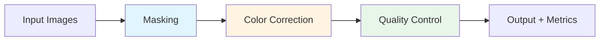
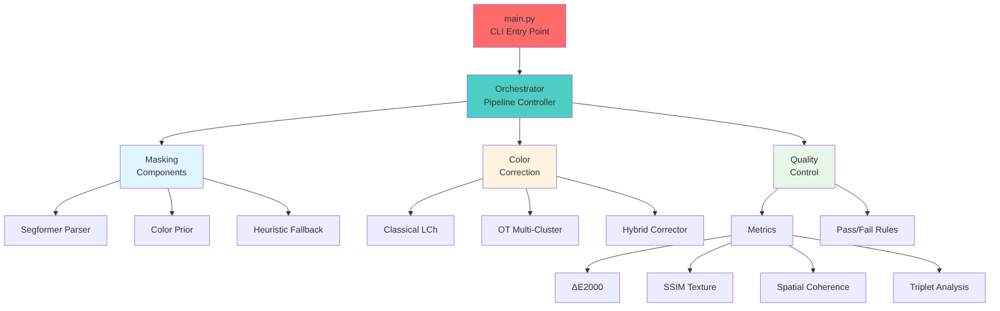
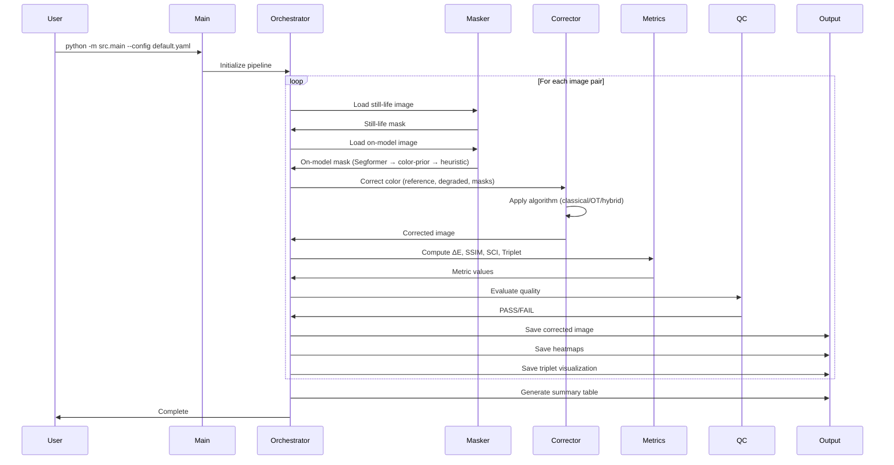
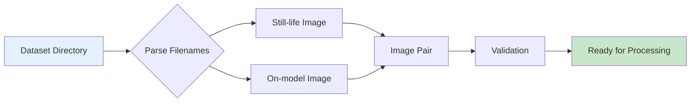
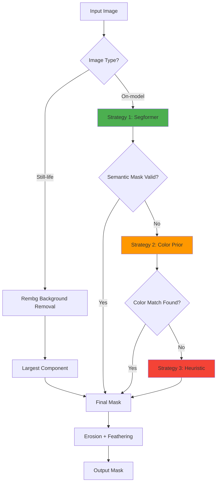
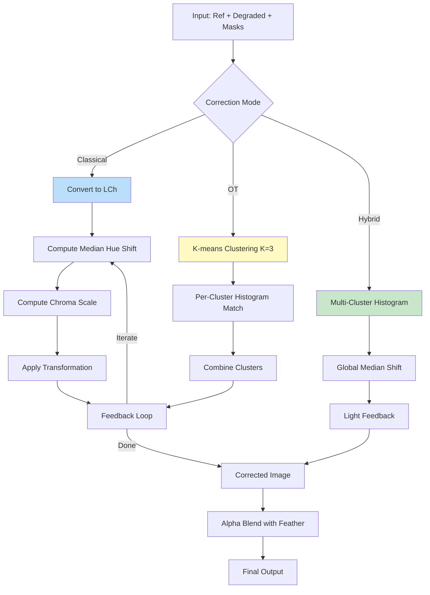
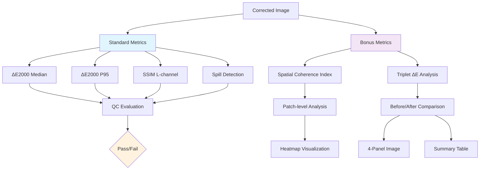
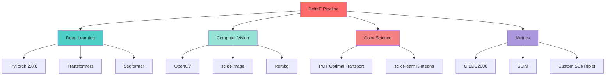
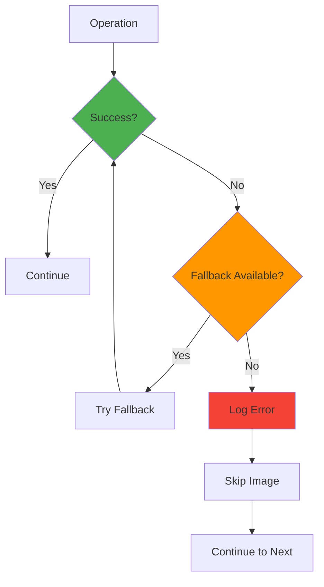

# System Architecture

Comprehensive architectural overview of the DeltaE color correction pipeline.

---

## Table of Contents

- [High-Level Overview](#high-level-overview)
- [System Components](#system-components)
- [Data Flow](#data-flow)
- [Processing Pipeline](#processing-pipeline)
- [Component Details](#component-details)

---

## High-Level Overview

DeltaE implements a modular pipeline architecture with three main stages:



### Design Principles

1. **Modularity**: Independent, swappable components
2. **Configurability**: YAML-driven parameters
3. **Observability**: Comprehensive logging and metrics
4. **Robustness**: Fallback strategies and error handling

---

## System Components

### Component Hierarchy



### Component Responsibilities

| Component | Responsibility | Key Files |
|-----------|---------------|-----------|
| **Orchestrator** | Pipeline coordination, error handling | `pipeline/orchestrator.py` |
| **Masking** | Garment segmentation, mask generation | `masking/*.py` |
| **Color Correction** | Color transformation algorithms | `color/*.py` |
| **Metrics** | Quality measurement, validation | `metrics/*.py` |
| **QC** | Pass/fail evaluation | `qc/rules.py` |
| **I/O** | Data loading, image pairs | `pipeline/io.py` |

---

## Data Flow

### End-to-End Processing



---

## Processing Pipeline

### 1. Image Loading



**Implementation**: `pipeline/io.py`
- Scans `input_dir` for `{ID}_still-life.jpg` and `{ID}_on-model.jpg`
- Creates `Pair` objects with metadata
- Validates image dimensions and format

### 2. Masking Pipeline



**Multi-Strategy Fallback**:
1. **Segformer** (primary): Semantic segmentation, most accurate
2. **Color Prior**: Match colors from reference still-life
3. **Heuristic**: Center-weighted largest component

**Details**: [Masking Components](components/masking.md)

### 3. Color Correction Algorithms



**Algorithm Comparison**:

| Algorithm | Approach | Strength | Weakness |
|-----------|----------|----------|----------|
| **Classical** | Hue rotation + chroma scaling | Fast, simple | Poor on patterns |
| **OT** | Histogram matching per cluster | Handles patterns | Can be unstable |
| **Hybrid** | Histogram + global shift | Best accuracy | Slower |

**Details**: [Color Correction Components](components/color.md)

### 4. Metrics Computation



**Details**: [Metrics & QC Components](components/metrics.md)

---

## Component Details

### Core Modules

#### 1. **Orchestrator** (`pipeline/orchestrator.py`)

**Purpose**: Main pipeline controller

**Responsibilities**:
- Initialize all components (maskers, correctors)
- Iterate over image pairs
- Coordinate masking → correction → metrics flow
- Handle errors and logging
- Generate summary reports

**Key Methods**:
```python
run_pairs(pairs, masks_dir, output_dir, logs_dir, cfg)
```

[→ Detailed Documentation](components/pipeline.md)

---

#### 2. **Masking Pipeline** (`masking/`)

**Purpose**: Generate precise garment masks

**Components**:

##### a. **Segformer Parser** (`segformer_parser.py`)
- Semantic segmentation using HuggingFace Transformers
- Targets: upper-clothes, coat, dress, jacket, etc.
- Device: MPS (Mac) / CUDA (Linux) / CPU
- **[Documentation](components/masking.md#segformer)**

##### b. **Color Prior** (`onmodel_color_prior.py`)
- Fallback: match colors from reference still-life
- HSV-based color distance
- Morphological cleanup
- **[Documentation](components/masking.md#color-prior)**

##### c. **Heuristic** (`base.py`)
- Last resort: center-weighted largest component
- Simple but robust
- **[Documentation](components/masking.md#heuristic)**

**Pipeline Class**: `OnModelMaskerPipeline` (`onmodel_pipeline.py`)
- Tries strategies in order
- Returns first valid mask
- Logs which strategy succeeded

---

#### 3. **Color Correction** (`color/`)

**Purpose**: Transform degraded colors to match reference

##### a. **Classical LCh** (`classical_lab.py`)
```python
ClassicalLabCorrector(deltaE_target, max_iter, feedback_strength)
```
- Converts to LCh color space
- Preserves luminance (L)
- Rotates hue, scales chroma
- Iterative feedback loop
- **[Documentation](components/color.md#classical)**

##### b. **Optimal Transport** (`ot_color_corrector.py`)
```python
OptimalTransportCorrector(num_clusters, ot_reg, max_samples, ...)
```
- K-means clustering (K=3)
- Per-cluster histogram matching
- Subsampling to prevent OOM
- **[Documentation](components/color.md#optimal-transport)**

##### c. **Hybrid** (`hybrid_corrector.py`) ⭐
```python
HybridCorrector(num_clusters, global_shift, feedback_strength, ...)
```
- Multi-cluster histogram matching
- Global median shift for precision
- Light feedback refinement
- **Best performance: 80% pass rate**
- **[Documentation](components/color.md#hybrid)**

---

#### 4. **Metrics** (`metrics/`)

**Purpose**: Measure correction quality

##### a. **Color Metrics** (`color_metrics.py`)
```python
deltaE_between_medians(ref, ref_mask, img, img_mask)
deltaE_q_to_ref_median(img, mask, ref, ref_mask, q=95)
```
- ΔE2000 (CIEDE2000) computation
- Median-to-median comparison
- Percentile metrics
- **[Documentation](components/metrics.md#color)**

##### b. **Texture Metrics** (`texture_metrics.py`)
```python
ssim_L(img1, img2, mask)
```
- SSIM on L-channel only
- Preserves texture evaluation
- **[Documentation](components/metrics.md#texture)**

##### c. **Spatial Coherence** (`spatial_coherence.py`)
```python
compute_spatial_coherence(corrected, ref_lab, ref_mask, mask, patch_size)
create_heatmap_visualization(...)
```
- Patch-level ΔE analysis
- Identifies regional failures
- Heatmap generation
- **[Documentation](components/metrics.md#spatial-coherence)**

##### d. **Triplet Analysis** (`triplet_analysis.py`)
```python
compute_triplet_delta_e(still, still_mask, original, original_mask, corrected)
create_triplet_visualization(...)
format_triplet_table(results, mode)
```
- Before/after comparison
- 4-panel visualizations
- Summary tables
- **[Documentation](components/metrics.md#triplet-analysis)**

---

#### 5. **Quality Control** (`qc/rules.py`)

**Purpose**: Pass/fail evaluation

```python
evaluate(dE_med, dE_p95, ssim, spill, 
         threshold_dE_med, threshold_dE_p95, 
         threshold_ssim, threshold_spill)
```

**Pass Criteria**:
- ΔE median ≤ 3.0
- ΔE P95 ≤ 60.0
- SSIM ≥ 0.90
- Spill ≤ 0.5

**[Documentation](components/metrics.md#quality-control)**

---

#### 6. **Configuration** (`schemas/config.py`)

**Purpose**: Type-safe configuration with Pydantic

**Schema Hierarchy**:
```python
AppConfig
├── RunConfig (paths, directories)
├── ColorConfig (correction mode, parameters)
├── MaskingConfig (erosion, feathering)
│   └── OnModelColorPriorConfig
└── QCConfig (thresholds, metrics)
```

**Benefits**:
- Type validation
- Default values
- IDE autocomplete
- Error messages

---

## Technology Stack

### Core Libraries



### Platform Support

| Platform | Acceleration | Status |
|----------|--------------|--------|
| **Mac M2/M3** | MPS | ✅ Tested |
| **Linux** | CUDA 11.8+ | ✅ Compatible |
| **Windows** | CUDA / CPU | ✅ Compatible |

---

## Performance Characteristics

### Processing Time (per image)

| Component | Time | Bottleneck |
|-----------|------|------------|
| Segformer Masking | ~0.5s | GPU inference |
| Classical Correction | ~0.1s | Lightweight |
| OT Correction | ~2.0s | Histogram matching |
| Hybrid Correction | ~1.5s | Clustering |
| Metrics (all) | ~0.3s | ΔE computation |
| **Total (Hybrid)** | **~2.5s** | - |

### Memory Usage

| Operation | Peak RAM |
|-----------|----------|
| Segformer Model | ~1.5GB |
| Image Processing | ~500MB |
| OT Clustering | ~200MB |
| **Total** | **~2.5GB** |

---

## Error Handling & Robustness

### Fallback Strategies



**Examples**:
1. **Masking**: Segformer → Color Prior → Heuristic
2. **Color**: NaN check → fallback to histogram matching
3. **Metrics**: Invalid result → skip metric, continue pipeline

---

## Extensibility

### Adding New Components

#### 1. New Color Corrector

```python
# src/color/my_corrector.py
from .base import ColorCorrector

class MyCorrector(ColorCorrector):
    def correct(self, on_model_bgr, on_model_mask_core, 
                on_model_mask_full, ref_bgr, ref_mask_core):
        # Your algorithm here
        return corrected_bgr
```

Update `orchestrator.py`:
```python
elif cfg.color.mode == "my_algorithm":
    corrector = MyCorrector(...)
```

#### 2. New Metric

```python
# src/metrics/my_metric.py
def compute_my_metric(corrected, reference, mask):
    # Your metric here
    return metric_value
```

Add to orchestrator metrics section.

---

## Next Steps

- **[Installation Guide](installation.md)** - Setup and configuration
- **[Component Documentation](components/)** - Detailed module descriptions
- **[Methodology](methodology.md)** - Dataset and approach
- **[Evaluation](evaluation.md)** - Metrics and results

---

**For questions or contributions**, see the main [README](../README.md).
