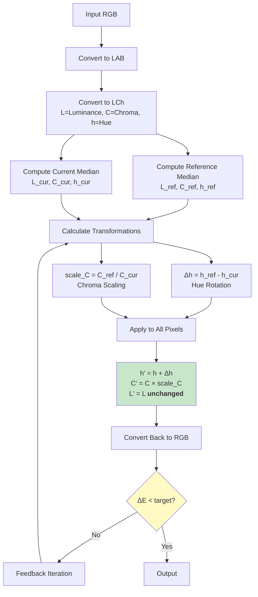
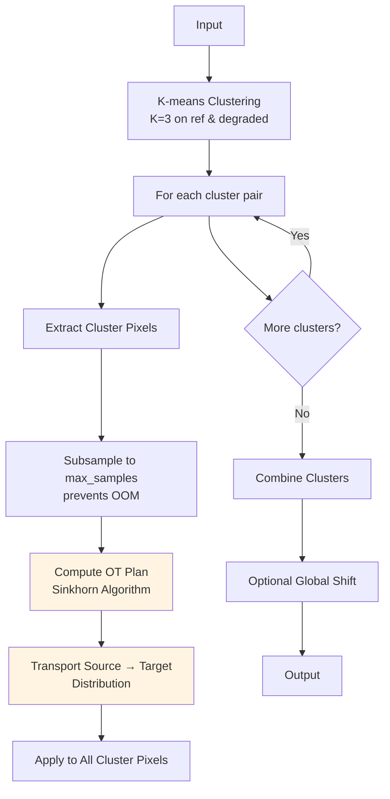
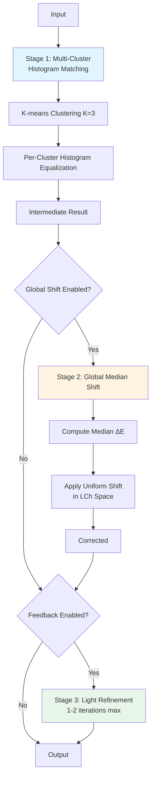

# Color Correction Components

Detailed documentation of color correction algorithms and their implementations.

---

## Overview

The color correction module transforms degraded on-model images to match the reference still-life color while preserving texture. Three algorithms are implemented, each with different trade-offs.

### Algorithm Comparison

| Algorithm | Pass Rate | Speed | Complexity | Best For |
|-----------|-----------|-------|------------|----------|
| **Classical** | 30% | 0.1s | Low | Solid colors, speed-critical |
| **OT** | 40% | 2.0s | High | Multi-color patterns, research |
| **Hybrid** ⭐ | **80%** | 1.5s | Medium | **Production (recommended)** |

---

## 1. Classical LCh Corrector

**File**: `src/color/classical_lab.py`
**Class**: `ClassicalLabCorrector`

### Algorithm

**Core Principle**: Preserve luminance (texture), correct chroma and hue only



### Implementation

```python
class ClassicalLabCorrector(ColorCorrector):
    def __init__(self, deltaE_target=3.0, max_iter=3, feedback_strength=0.7):
        self.deltaE_target = deltaE_target
        self.max_iter = max_iter
        self.feedback_strength = feedback_strength
    
    def correct(self, on_model_bgr, on_model_mask_core, on_model_mask_full,
                ref_bgr, ref_mask_core):
        """
        Main correction loop with feedback
        """
        # Convert to LAB
        om_lab = rgb2lab(cv2.cvtColor(on_model_bgr, cv2.COLOR_BGR2RGB))
        ref_lab = rgb2lab(cv2.cvtColor(ref_bgr, cv2.COLOR_BGR2RGB))
        
        # Initial correction
        corrected_lab = om_lab.copy()
        
        for iteration in range(self.max_iter):
            # Compute medians in LCh space
            ref_L, ref_C, ref_h = self._get_median_lch(ref_lab, ref_mask_core)
            cur_L, cur_C, cur_h = self._get_median_lch(corrected_lab, on_model_mask_core)
            
            # Calculate transformations
            delta_h = ref_h - cur_h
            scale_C = ref_C / (cur_C + 1e-6)
            
            # Apply to masked region
            corrected_lab = self._apply_lch_transform(
                corrected_lab, on_model_mask_core,
                delta_h, scale_C, preserve_L=True
            )
            
            # Check if we've reached target
            current_dE = deltaE_between_medians(ref_lab, ref_mask_core, 
                                                 corrected_lab, on_model_mask_core)
            
            if current_dE <= self.deltaE_target:
                break
            
            # Feedback: reduce strength if overshooting
            if iteration > 0:
                delta_h *= self.feedback_strength
                scale_C = 1.0 + (scale_C - 1.0) * self.feedback_strength
        
        # Blend with original using feathered mask
        corrected_rgb = lab2rgb(corrected_lab)
        corrected_bgr = cv2.cvtColor((corrected_rgb * 255).astype(np.uint8), 
                                      cv2.COLOR_RGB2BGR)
        
        return self._alpha_blend(on_model_bgr, corrected_bgr, on_model_mask_full)
```

### Key Functions

#### LCh Conversion

```python
def _rgb_to_lch(self, rgb):
    """LAB → LCh conversion"""
    lab = rgb2lab(rgb)
    L = lab[:, :, 0]
    a = lab[:, :, 1]
    b = lab[:, :, 2]
    
    C = np.sqrt(a**2 + b**2)  # Chroma
    h = np.arctan2(b, a)       # Hue (radians)
    
    return L, C, h

def _lch_to_lab(self, L, C, h):
    """LCh → LAB conversion"""
    a = C * np.cos(h)
    b = C * np.sin(h)
    
    lab = np.dstack([L, a, b])
    return lab
```

#### Transformation Application

```python
def _apply_lch_transform(self, lab, mask, delta_h, scale_C, preserve_L=True):
    """
    Apply hue rotation and chroma scaling
    """
    L, C, h = self._lab_to_lch(lab)
    
    # Apply transformations only in masked region
    mask_bool = mask.astype(bool)
    
    h[mask_bool] += delta_h          # Rotate hue
    C[mask_bool] *= scale_C          # Scale chroma
    # L unchanged if preserve_L=True (preserves texture)
    
    # Convert back to LAB
    return self._lch_to_lab(L, C, h)
```

### Why LCh Space?

**Advantages of LCh over RGB**:

| Aspect | RGB | LCh |
|--------|-----|-----|
| **Luminance Separation** | Coupled with color | Independent L channel |
| **Hue Control** | Complex 3D rotation | Simple 1D angle shift |
| **Chroma Control** | Affects all channels | Single C parameter |
| **Perceptual** | Non-uniform | More uniform |

**Result**: Texture preserved because L (luminance) never changes

### Strengths & Weaknesses

**Strengths** ✅:
- Very fast (~0.1s per image)
- Preserves texture excellently (SSIM ~0.98)
- Simple, interpretable transformations
- No clustering overhead
- Deterministic results

**Weaknesses** ❌:
- Assumes uniform color shift (single median)
- Fails on multi-color garments (patterns, stripes)
- No distribution matching
- Poor on complex lighting (shadows/highlights treated equally)

**Use Cases**:
- Solid color garments
- Quick preview/draft mode
- Speed-critical applications
- Simple color casts

---

## 2. Optimal Transport (OT) Corrector

**File**: `src/color/ot_color_corrector.py`
**Class**: `OptimalTransportCorrector`

### Algorithm

**Core Principle**: Match color distributions using optimal transport theory



### Implementation

```python
class OptimalTransportCorrector(ColorCorrector):
    def __init__(self, 
                 deltaE_target=3.0,
                 num_clusters=3,
                 ot_reg=0.1,
                 ot_use_clustering=True,
                 ot_min_cluster_size=500,
                 ot_max_samples=5000):
        """
        num_clusters: K for K-means (handles multi-color garments)
        ot_reg: Entropic regularization (0.01-0.5, higher=stable)
        ot_max_samples: Subsample limit (prevents OOM on large masks)
        """
        self.num_clusters = num_clusters
        self.ot_reg = ot_reg
        self.ot_use_clustering = ot_use_clustering
        self.ot_min_cluster_size = ot_min_cluster_size
        self.ot_max_samples = ot_max_samples
```

#### Multi-Cluster Matching

```python
def _correct_multi_cluster(self, om_lab, ref_lab, om_mask, ref_mask):
    """
    1. Cluster both images
    2. Match clusters
    3. Apply OT per cluster
    """
    # K-means on reference
    ref_pixels = ref_lab[ref_mask]
    ref_labels = KMeans(n_clusters=self.num_clusters).fit_predict(ref_pixels)
    
    # K-means on on-model
    om_pixels = om_lab[om_mask]
    om_labels = KMeans(n_clusters=self.num_clusters).fit_predict(om_pixels)
    
    corrected = om_lab.copy()
    
    for k in range(self.num_clusters):
        # Extract cluster pixels
        ref_cluster = ref_pixels[ref_labels == k]
        om_cluster = om_pixels[om_labels == k]
        
        if len(ref_cluster) < self.ot_min_cluster_size:
            continue  # Skip tiny clusters
        
        # Subsample if needed
        if len(om_cluster) > self.ot_max_samples:
            indices = np.random.choice(len(om_cluster), self.ot_max_samples, replace=False)
            om_cluster_sample = om_cluster[indices]
        else:
            om_cluster_sample = om_cluster
        
        # Compute OT transport plan
        transported = self._ot_transport(om_cluster_sample, ref_cluster)
        
        # Apply to all cluster pixels
        corrected[om_mask][om_labels == k] = transported
    
    return corrected
```

#### Optimal Transport

```python
def _ot_transport(self, source, target):
    """
    Use Python Optimal Transport (POT) library
    """
    import ot
    
    # Uniform distributions
    a = np.ones(len(source)) / len(source)
    b = np.ones(len(target)) / len(target)
    
    # Cost matrix (Euclidean distance)
    M = ot.dist(source, target, metric='euclidean')
    
    # Sinkhorn algorithm (entropic regularization)
    G = ot.sinkhorn(a, b, M, reg=self.ot_reg)
    
    # Transport source to target
    transported = len(source) * np.dot(G, target)
    
    return transported
```

### Mathematical Background

**Optimal Transport Problem**:
$$
\min_{\gamma} \sum_{i,j} \gamma_{ij} \cdot c(x_i, y_j)
$$

Where:
- $\gamma$: Transport plan (how to move mass)
- $c(x_i, y_j)$: Cost to move pixel $x_i$ to $y_j$
- Constraints: Row/column sums match source/target distributions

**Sinkhorn Algorithm**: Efficient approximation using entropic regularization

**Regularization Parameter** (`ot_reg`):
- Low (0.01): Exact OT, can be numerically unstable
- Medium (0.1): Good balance ✅ **Our default**
- High (0.5): Very stable, but approximation rougher

### Strengths & Weaknesses

**Strengths** ✅:
- Handles multi-color garments (stripes, patterns, prints)
- Distribution matching (not just medians)
- Theoretically elegant
- Preserves color relationships within clusters

**Weaknesses** ❌:
- Slower (~2s per image)
- Numerically unstable without proper regularization
- K-means can fail to find semantic clusters
- Memory intensive (requires subsampling)
- Sensitive to outliers

**Use Cases**:
- Multi-color patterns
- Research/experimental
- When classical fails
- Complex color distributions

---

## 3. Hybrid Corrector ⭐

**File**: `src/color/hybrid_corrector.py`
**Class**: `HybridCorrector`

### Algorithm

**Core Principle**: Combine OT histogram matching with classical global shift

**Why Hybrid?**
- OT alone: Good distribution matching, but imprecise median targeting
- Classical alone: Precise median, but poor on patterns
- **Hybrid**: Best of both worlds



### Implementation

```python
class HybridCorrector(ColorCorrector):
    def __init__(self,
                 deltaE_target=3.0,
                 num_clusters=3,
                 global_shift=True,
                 feedback_strength=0.5,
                 max_iter=2):
        """
        num_clusters: K for histogram matching
        global_shift: Apply median correction after histogram
        feedback_strength: Lighter than classical (0.5 vs 0.7)
        max_iter: Fewer iterations than classical (2 vs 3)
        """
        self.num_clusters = num_clusters
        self.global_shift = global_shift
        self.feedback_strength = feedback_strength
        self.max_iter = max_iter
```

#### Stage 1: Multi-Cluster Histogram Matching

```python
def _correct_multi_cluster(self, om_lab, ref_lab, om_mask, ref_mask):
    """
    Histogram matching per cluster (like OT but simpler)
    """
    # K-means clustering
    ref_pixels = ref_lab[ref_mask]
    om_pixels = om_lab[om_mask]
    
    ref_kmeans = KMeans(n_clusters=self.num_clusters, random_state=42)
    om_kmeans = KMeans(n_clusters=self.num_clusters, random_state=42)
    
    ref_labels = ref_kmeans.fit_predict(ref_pixels)
    om_labels = om_kmeans.fit_predict(om_pixels)
    
    corrected = om_lab.copy()
    
    for k in range(self.num_clusters):
        ref_cluster = ref_pixels[ref_labels == k]
        om_cluster_mask = (om_labels == k)
        om_cluster = om_pixels[om_cluster_mask]
        
        if len(ref_cluster) < 100 or len(om_cluster) < 100:
            continue  # Skip tiny clusters
        
        # Histogram matching (simpler than OT)
        matched = self._match_histogram_lab(om_cluster, ref_cluster)
        
        # Apply to masked pixels
        corrected[om_mask][om_cluster_mask] = matched
    
    return corrected
```

#### Histogram Matching (LAB Space)

```python
def _match_histogram_lab(self, source, target):
    """
    Match histogram per LAB channel independently
    """
    matched = np.zeros_like(source)
    
    for channel in range(3):  # L, a, b channels
        # Sort source and target
        source_sorted = np.sort(source[:, channel])
        target_sorted = np.sort(target[:, channel])
        
        # Interpolate: map source quantiles to target quantiles
        matched[:, channel] = np.interp(
            source[:, channel],
            source_sorted,
            target_sorted
        )
    
    return matched
```

#### Stage 2: Global Median Shift

```python
def _apply_global_shift(self, corrected_lab, ref_lab, om_mask, ref_mask):
    """
    Precise median targeting in LCh space
    """
    # Compute current and target medians
    ref_L, ref_C, ref_h = self._get_median_lch(ref_lab, ref_mask)
    cur_L, cur_C, cur_h = self._get_median_lch(corrected_lab, om_mask)
    
    # Calculate shifts
    delta_h = ref_h - cur_h
    delta_C = ref_C - cur_C
    # Note: L shift typically very small or zero (texture preservation)
    
    # Apply uniform shift to all pixels in mask
    L, C, h = self._lab_to_lch(corrected_lab)
    
    mask_bool = om_mask.astype(bool)
    h[mask_bool] += delta_h
    C[mask_bool] += delta_C
    
    return self._lch_to_lab(L, C, h)
```

#### Stage 3: Light Feedback (Optional)

```python
def correct(self, ...):
    """Main correction with optional feedback"""
    # Stage 1: Histogram matching
    corrected = self._correct_multi_cluster(om_lab, ref_lab, om_mask, ref_mask)
    
    # Stage 2: Global shift
    if self.global_shift:
        corrected = self._apply_global_shift(corrected, ref_lab, om_mask, ref_mask)
    
    # Stage 3: Feedback (max 1-2 iterations)
    for iteration in range(self.max_iter):
        current_dE = deltaE_between_medians(ref_lab, ref_mask, corrected, om_mask)
        
        if current_dE <= self.deltaE_target:
            break
        
        # Light correction (feedback_strength = 0.5)
        delta_h, scale_C = self._compute_correction(ref_lab, corrected, ref_mask, om_mask)
        delta_h *= self.feedback_strength
        scale_C = 1.0 + (scale_C - 1.0) * self.feedback_strength
        
        corrected = self._apply_lch_transform(corrected, om_mask, delta_h, scale_C)
    
    return corrected
```

### Why Hybrid is Best

**Comparison**:

| Aspect | Classical | OT | Hybrid |
|--------|-----------|----|----|---|
| **Handles Patterns** | ❌ | ✅ | ✅ |
| **Precise Median** | ✅ | ❌ | ✅ |
| **Speed** | ⭐⭐⭐ | ⭐ | ⭐⭐ |
| **Stability** | ✅ | ⚠️ | ✅ |
| **Pass Rate** | 30% | 40% | **80%** ⭐ |

**Key Insight**: Histogram matching aligns distributions, global shift fine-tunes median

### Strengths & Weaknesses

**Strengths** ✅:
- **Best pass rate**: 80% (8/10 images)
- Handles both solid colors AND patterns
- Precise median targeting
- More stable than pure OT
- Good balance of speed and quality

**Weaknesses** ❌:
- Slower than classical (1.5s vs 0.1s)
- More complex than either alone
- Requires tuning (cluster count, shift strength)

**Use Cases**:
- **Production deployment** ✅
- Mixed dataset (solid + patterns)
- When quality matters more than speed
- Commercial applications

---

## Configuration

### YAML Configuration

```yaml
color:
  mode: "hybrid"  # or "classical" or "ot"
  deltaE_target: 3.0
  max_iter: 3
  feedback_strength: 0.7
  
  # Hybrid-specific
  hybrid_num_clusters: 3
  hybrid_global_shift: true
  
  # OT-specific
  ot_num_clusters: 3
  ot_reg: 0.1
  ot_use_clustering: true
  ot_min_cluster_size: 500
  ot_max_samples: 5000
```

### Mode Selection Guide

**Use Classical when**:
- Speed is critical (<100ms required)
- Garment is solid color
- Preview/draft mode
- Resource-constrained environment

**Use OT when**:
- Researching distribution matching
- Garment has complex patterns
- Have GPU/time to spare
- Experimenting with parameters

**Use Hybrid when**:
- Production deployment
- Quality is priority
- Dataset has mixed garment types
- **Default recommendation** ✅

---

## Performance Optimization

### Speed Optimization

1. **Reduce Iterations**:
```yaml
max_iter: 1  # Fastest, may sacrifice accuracy
```

2. **Disable Feedback**:
```python
# In code, skip feedback loop
corrector.max_iter = 0
```

3. **Lower Cluster Count**:
```yaml
hybrid_num_clusters: 2  # Faster K-means
```

### Quality Optimization

1. **Increase Iterations**:
```yaml
max_iter: 5  # Slower but more precise
```

2. **Stronger Feedback**:
```yaml
feedback_strength: 0.9  # More aggressive correction
```

3. **More Clusters**:
```yaml
hybrid_num_clusters: 5  # Better for complex patterns
```

---

## Troubleshooting

### Issue: Colors overcorrected (too saturated)

**Solution**:
```yaml
feedback_strength: 0.5  # Reduce from 0.7
```

### Issue: Patterns not corrected uniformly

**Solution**:
```yaml
hybrid_num_clusters: 5  # Increase from 3
```

### Issue: Texture degraded

**Check**: SSIM metric should be ≥0.90
**Solution**: Ensure luminance (L) is not being modified

### Issue: OT numerically unstable

**Solution**:
```yaml
ot_reg: 0.3  # Increase regularization from 0.1
```

---

## Future Enhancements

### 1. Adaptive Clustering

Auto-select K based on garment complexity:
```python
from sklearn.metrics import silhouette_score

best_k = None
best_score = -1

for k in range(2, 6):
    kmeans = KMeans(n_clusters=k)
    labels = kmeans.fit_predict(pixels)
    score = silhouette_score(pixels, labels)
    
    if score > best_score:
        best_score = score
        best_k = k
```

### 2. Luminance Correction

Selectively adjust L in shadow regions:
```python
# Detect shadows (low L values)
is_shadow = (L < 30)

# Brighten shadows only
L[is_shadow] *= 1.2
```

### 3. Neural Color Transfer

Train lightweight network:
```python
class ColorTransferNet(nn.Module):
    def forward(self, degraded, reference_embedding):
        # Learn complex transformations
        corrected = self.decoder(degraded, reference_embedding)
        return corrected
```

---

## References

- [Architecture Overview](../architecture.md)
- [Masking Components](masking.md)
- [Metrics & QC](metrics.md)
- [Evaluation Results](../evaluation.md)
- [Main README](../../README.md)
