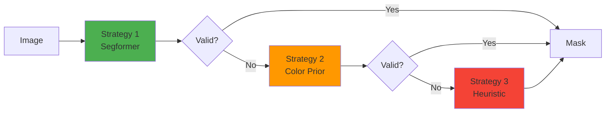

# Masking Components

Detailed documentation of garment segmentation and mask generation components.

---

## Overview

The masking pipeline is responsible for precisely identifying garment pixels in both still-life and on-model images. Accurate masking is **critical** - even the best color correction algorithm cannot succeed with a poor mask.

### Design Philosophy

**Multi-Strategy Fallback**: Try sophisticated methods first, fall back to simpler approaches if needed



---

## Components

### 1. Still-Life Masker (`stilllife_rembg_sam2.py`)

**Purpose**: Extract garment from product photos (clean backgrounds)

**Implementation**: `StillLifeRembgMasker`

#### Algorithm

```python
class StillLifeRembgMasker:
    def get_mask(self, image_bgr: np.ndarray) -> np.ndarray:
        """
        1. Rembg background removal
        2. Extract largest connected component
        3. Morphological cleanup
        """
```

**Steps**:

1. **Rembg**: AI-powered background removal
   - Removes white/colored backgrounds
   - Produces alpha mask
   
2. **Connected Components**: Keep largest region
   - Handles multiple objects
   - Removes noise
   
3. **Cleanup**: Morphological operations
   - Fill holes
   - Smooth edges

**Pros**:
- ✅ Accurate for product photos
- ✅ No training needed
- ✅ Fast (~0.3s)

**Cons**:
- ❌ Requires clean background
- ❌ May fail on patterned backgrounds

**Configuration**: No parameters (automatic)

---

### 2. Segformer Parser (`segformer_parser.py`)

**Purpose**: Semantic segmentation of on-model images using deep learning

**Implementation**: `SegformerParser`

#### Model Details

**HuggingFace Model**: `mattmdjaga/segformer_b2_clothes`

**Architecture**: SegFormer-B2
- Transformer-based semantic segmentation
- Pretrained on fashion datasets
- 19 semantic classes (shirt, dress, pants, etc.)

**Target Classes for Garments**:
```python
GARMENT_LABELS = [
    'upper-clothes', 'coat', 'dress', 'jacket',
    't-shirt', 'vest', 'hoodie', 'cardigan',
    'blouse', 'sweater'
]
```

#### Implementation

```python
class SegformerParser:
    def __init__(self, model_name="mattmdjaga/segformer_b2_clothes", device=None):
        """
        Load Segformer model with MPS/CUDA/CPU support
        """
        self.processor = AutoImageProcessor.from_pretrained(model_name)
        self.model = AutoModelForSemanticSegmentation.from_pretrained(model_name)
        
        # Auto-detect device (MPS for Mac M2, CUDA for Linux, CPU fallback)
        if device is None:
            if torch.backends.mps.is_available():
                device = "mps"
            elif torch.cuda.is_available():
                device = "cuda"
            else:
                device = "cpu"
        
        self.model.to(device)
        
    def get_mask(self, image_bgr: np.ndarray) -> np.ndarray:
        """
        Run semantic segmentation and extract garment mask
        """
        # Convert BGR → RGB
        image_rgb = cv2.cvtColor(image_bgr, cv2.COLOR_BGR2RGB)
        
        # Preprocess
        inputs = self.processor(images=image_rgb, return_tensors="pt")
        inputs = {k: v.to(self.device) for k, v in inputs.items()}
        
        # Inference
        with torch.no_grad():
            outputs = self.model(**inputs)
        
        # Get predicted class per pixel
        logits = outputs.logits
        predicted = logits.argmax(dim=1)[0].cpu().numpy()
        
        # Combine all garment classes into binary mask
        mask = np.zeros_like(predicted, dtype=np.uint8)
        for label in GARMENT_LABELS:
            label_id = self.model.config.id2label[label]
            mask[predicted == label_id] = 255
        
        return mask
```

#### Device Support

**Mac M2/M3** (MPS):
```python
device = "mps"
# ~0.5s inference
```

**Linux** (CUDA):
```python
device = "cuda"
# ~0.3s inference
```

**CPU Fallback**:
```python
device = "cpu"
# ~2s inference (slower but works)
```

#### Pros & Cons

**Advantages** ✅:
- Semantic understanding (knows what clothes are)
- Handles complex backgrounds
- No manual annotation needed
- Cross-platform (Mac/Linux/Windows)
- Pretrained, no custom training

**Limitations** ❌:
- Not 100% accurate (especially on unusual garments)
- Requires GPU/MPS for speed
- May misclassify accessories
- Fixed to pretrained classes

**When It Works Well**:
- Standard garments (shirts, dresses, jackets)
- Clear visibility
- Upright models
- Professional photography

**When It Struggles**:
- Unusual garments (capes, scarves alone)
- Heavy occlusion
- Extreme poses
- Very dark/light garments

---

### 3. Color Prior Masker (`onmodel_color_prior.py`)

**Purpose**: Fallback strategy using color matching from reference still-life

**Implementation**: `OnModelColorPrior`

#### Algorithm

**Core Idea**: If we know the garment color from still-life, find similar colors in on-model image

```python
class OnModelColorPrior:
    def get_mask_with_ref(self, on_model_bgr, still_bgr, still_mask, logger=None):
        """
        1. Extract reference colors from still-life
        2. Dilate reference mask to capture color variation
        3. Convert to HSV for better color matching
        4. Find similar colors in on-model image
        5. Morphological cleanup
        """
```

**Steps**:

##### Step 1: Extract Reference Colors

```python
# Dilate still-life mask to capture color variation
ref_dilated = cv2.dilate(still_mask, kernel, iterations=ref_dilate_iters)

# Sample colors from reference
ref_hsv = cv2.cvtColor(still_bgr, cv2.COLOR_BGR2HSV)
ref_colors = ref_hsv[ref_dilated > 0]

# Compute color statistics
h_min, h_max = percentile(ref_colors[:, 0], [5, 95])  # Hue range
s_min, s_max = percentile(ref_colors[:, 1], [5, 95])  # Saturation range
v_min, v_max = percentile(ref_colors[:, 2], [5, 95])  # Value range
```

##### Step 2: Color Matching in On-Model

```python
# Convert on-model to HSV
om_hsv = cv2.cvtColor(on_model_bgr, cv2.COLOR_BGR2HSV).astype(np.float32)

# Boost saturation for better detection
om_hsv[:, :, 1] = np.clip(om_hsv[:, :, 1] * saturation_boost, 0, 255)

# Create color range mask
mask = cv2.inRange(om_hsv.astype(np.uint8),
                   lower=(h_min, s_min, v_min),
                   upper=(h_max, s_max, v_max))
```

##### Step 3: Morphological Cleanup

```python
# Opening: remove small noise
mask = cv2.morphologyEx(mask, cv2.MORPH_OPEN, kernel_open)

# Closing: fill holes
mask = cv2.morphologyEx(mask, cv2.MORPH_CLOSE, kernel_close)

# Keep only largest component
mask = keep_largest_connected_component(mask)
```

#### Configuration Parameters

| Parameter | Default | Description |
|-----------|---------|-------------|
| `ref_dilate_iters` | 10 | How much to expand ref mask for color sampling |
| `saturation_boost` | 1.2 | Boost saturation for better detection |
| `morph_open_ksize` | 5 | Opening kernel size (noise removal) |
| `morph_close_ksize` | 7 | Closing kernel size (hole filling) |
| `min_mask_pixels` | 2000 | Minimum mask size to be valid |

#### Pros & Cons

**Advantages** ✅:
- No deep learning required (fast)
- Uses reference color information
- Good for solid colors
- Robust to background clutter

**Limitations** ❌:
- Assumes color similarity (fails if lighting drastically different)
- Poor on multi-color garments
- Sensitive to parameter tuning
- May include background with similar colors

**When It Works**:
- Solid color garments
- Similar lighting conditions
- Distinct garment color from background

**When It Fails**:
- Multi-color patterns
- Extreme lighting changes
- Background has similar colors
- Very dark or very bright garments

---

### 4. Heuristic Fallback (`base.py`)

**Purpose**: Last-resort simple masking when all else fails

**Implementation**: `Masker.get_mask()` (base class)

#### Algorithm

**Assumption**: Garment is the largest connected component in center region

```python
def get_mask(self, image_bgr: np.ndarray) -> np.ndarray:
    """
    1. Convert to grayscale
    2. Otsu's thresholding
    3. Find connected components
    4. Keep largest component near center
    """
    gray = cv2.cvtColor(image_bgr, cv2.COLOR_BGR2GRAY)
    
    # Otsu's automatic thresholding
    _, binary = cv2.threshold(gray, 0, 255, cv2.THRESH_BINARY + cv2.THRESH_OTSU)
    
    # Find connected components
    num_labels, labels, stats, centroids = cv2.connectedComponentsWithStats(binary)
    
    # Score by: size × center proximity
    H, W = image_bgr.shape[:2]
    center_y, center_x = H // 2, W // 2
    
    best_score = 0
    best_label = 0
    
    for i in range(1, num_labels):  # Skip background (0)
        area = stats[i, cv2.CC_STAT_AREA]
        cy, cx = centroids[i]
        
        # Distance from center (normalized)
        dist = np.sqrt((cy - center_y)**2 + (cx - center_x)**2)
        dist_norm = dist / np.sqrt(H**2 + W**2)
        
        # Score = area × (1 - distance)
        score = area * (1 - dist_norm)
        
        if score > best_score:
            best_score = score
            best_label = i
    
    # Extract best component
    mask = (labels == best_label).astype(np.uint8) * 255
    return mask
```

#### Pros & Cons

**Advantages** ✅:
- Always produces some mask
- Very fast
- No dependencies
- Parameter-free

**Limitations** ❌:
- Very crude approximation
- Fails on complex backgrounds
- No semantic understanding
- Often includes unwanted regions

**Use Case**: Safety net when Segformer and color prior both fail

---

### 5. Pipeline Orchestrator (`onmodel_pipeline.py`)

**Purpose**: Try masking strategies in order, use first valid result

**Implementation**: `OnModelMaskerPipeline`

#### Multi-Strategy Flow

```python
class OnModelMaskerPipeline:
    def __init__(self, strategies=['segformer', 'color_prior', 'heuristic']):
        """
        Initialize all masking strategies
        """
        self.strategies = []
        
        if 'segformer' in strategies:
            self.strategies.append(('segformer', SegformerParser()))
        
        if 'color_prior' in strategies:
            self.strategies.append(('color_prior', OnModelColorPrior()))
        
        if 'heuristic' in strategies:
            self.strategies.append(('heuristic', Masker()))
    
    def get_mask_with_ref(self, on_model_bgr, still_bgr, still_mask):
        """
        Try strategies in order until one succeeds
        """
        for name, masker in self.strategies:
            try:
                mask = masker.get_mask_with_ref(on_model_bgr, still_bgr, still_mask)
                
                # Validate mask
                if self._is_valid_mask(mask):
                    logger.info(f"✅ {name} → mask (px={mask.sum() // 255})")
                    return mask
                else:
                    logger.warning(f"❌ {name} → invalid mask, trying next")
            
            except Exception as e:
                logger.error(f"❌ {name} failed: {e}, trying next")
        
        # Should never reach here if heuristic is enabled
        raise RuntimeError("All masking strategies failed")
    
    def _is_valid_mask(self, mask):
        """Check if mask is reasonable"""
        pixel_count = mask.sum() // 255
        H, W = mask.shape
        total_pixels = H * W
        
        # Mask should cover 5-80% of image
        if pixel_count < 0.05 * total_pixels:
            return False
        if pixel_count > 0.80 * total_pixels:
            return False
        
        return True
```

#### Configuration

```yaml
masking:
  strategies: ['segformer', 'color_prior', 'heuristic']  # Order matters
  erosion_px: 5      # Erode mask by N pixels (avoid edges)
  feather_px: 15     # Feather radius for smooth blending
```

---

## Post-Processing

### Mask Refinement

After mask generation, apply erosion and feathering:

```python
def refine_mask(mask, erosion_px=5, feather_px=15):
    """
    1. Erode: shrink mask to avoid edges
    2. Feather: create smooth alpha transition
    """
    # Erosion
    kernel = cv2.getStructuringElement(cv2.MORPH_ELLIPSE, (erosion_px*2+1, erosion_px*2+1))
    mask_core = cv2.erode(mask, kernel, iterations=1)
    
    # Feathering (Gaussian blur for smooth transition)
    mask_full = cv2.GaussianBlur(mask.astype(np.float32), 
                                  (feather_px*2+1, feather_px*2+1), 
                                  feather_px/3.0)
    
    return mask_core, mask_full
```

**mask_core**: Conservative mask for color sampling (avoids edges)
**mask_full**: Feathered mask for blending (smooth transitions)

---

## Usage Examples

### Example 1: Still-Life Masking

```python
from src.masking.stilllife_rembg_sam2 import StillLifeRembgMasker

masker = StillLifeRembgMasker()
still_image = cv2.imread("00000_still-life.jpg")
mask = masker.get_mask(still_image)

# Result: Binary mask (255 = garment, 0 = background)
```

### Example 2: On-Model with Pipeline

```python
from src.masking.onmodel_pipeline import OnModelMaskerPipeline

pipeline = OnModelMaskerPipeline(strategies=['segformer', 'color_prior', 'heuristic'])
on_model = cv2.imread("00000_on-model.jpg")
still_image = cv2.imread("00000_still-life.jpg")
still_mask = masker.get_mask(still_image)

mask = pipeline.get_mask_with_ref(on_model, still_image, still_mask)
# Automatically tries Segformer first, falls back if needed
```

### Example 3: Segformer Only

```python
from src.masking.segformer_parser import SegformerParser

parser = SegformerParser(device="mps")  # Use Mac M2 acceleration
on_model = cv2.imread("00000_on-model.jpg")
mask = parser.get_mask(on_model)
```

---

## Performance Characteristics

| Strategy | Speed | Accuracy | Robustness | GPU Required |
|----------|-------|----------|------------|--------------|
| **Segformer** | ~0.5s | High (90%) | Good | Recommended |
| **Color Prior** | ~0.1s | Medium (60%) | Fair | No |
| **Heuristic** | ~0.05s | Low (30%) | Poor | No |

**Recommendation**: Use pipeline with all three strategies for maximum robustness.

---

## Troubleshooting

### Issue: Segformer returns empty mask

**Possible Causes**:
1. Model not loaded properly
2. Image preprocessing error
3. No garment detected (background-only image)

**Solutions**:
- Check model download: `transformers-cli download mattmdjaga/segformer_b2_clothes`
- Verify image format (BGR expected)
- Inspect predicted classes: add logging to see what Segformer detected

### Issue: Color prior includes background

**Possible Causes**:
1. Background has similar color to garment
2. Reference mask too dilated
3. Saturation boost too high

**Solutions**:
- Reduce `ref_dilate_iters` (try 5 instead of 10)
- Lower `saturation_boost` (try 1.1 instead of 1.2)
- Add additional filtering based on location

### Issue: Heuristic selects wrong region

**Possible Causes**:
1. Complex background with large objects
2. Garment not centered
3. Multiple garments in image

**Solutions**:
- This is expected - heuristic is a last resort
- Ensure Segformer or color prior succeed instead
- Manually adjust image framing if possible

---

## Future Enhancements

### 1. SAM v2 Integration

**Approach**: Use Segformer for coarse mask, SAM v2 for refinement

```python
# Coarse mask from Segformer
coarse_mask = segformer.get_mask(image)

# Refine edges with SAM v2
sam_predictor.set_image(image)
refined_mask = sam_predictor.predict(mask_input=coarse_mask)
```

### 2. Grounding DINO

**Approach**: Text-prompted segmentation ("red shirt")

```python
prompt = "upper garment, shirt, dress"
mask = grounding_dino.predict(image, prompt)
```

### 3. Temporal Consistency (Video)

**Approach**: Track garment across frames

```python
# Frame 1: Full segmentation
mask_t0 = segformer.get_mask(frame_0)

# Frame 2: Optical flow propagation
flow = optical_flow(frame_0, frame_1)
mask_t1 = warp_mask(mask_t0, flow)
```

---

## References

- [Architecture Overview](../architecture.md)
- [Color Correction Components](color.md)
- [Methodology](../methodology.md)
- [Main README](../../README.md)
