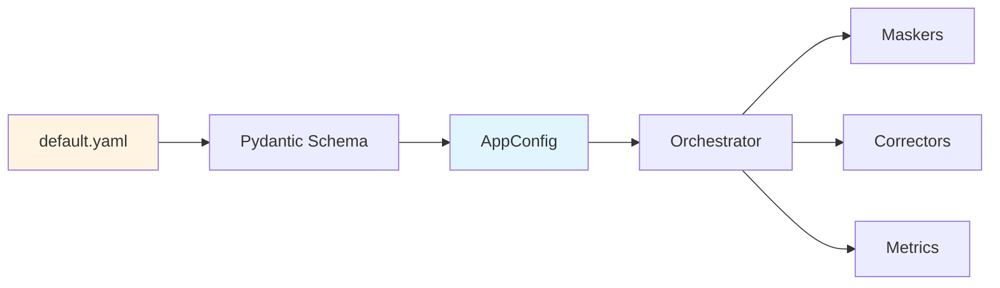

# Pipeline Orchestration

End-to-end pipeline coordination and workflow management.

---

## Overview

The orchestrator (`src/pipeline/orchestrator.py`) coordinates all components to process image pairs from input to corrected output with comprehensive metrics.

---

## Main Entry Point

**File**: `src/main.py`

```python
def main():
    # Load configuration
    config = AppConfig.from_yaml("configs/default.yaml")
    
    # Load image pairs
    pairs = load_pairs_from_directory(config.run.input_dir)
    
    # Run pipeline
    run_pairs(pairs, config.run.masks_dir, config.run.output_dir, 
              config.run.logs_dir, config)
```

---

## Orchestrator Flow

**File**: `src/pipeline/orchestrator.py`

### Initialization

```python
def run_pairs(pairs, masks_dir, output_dir, logs_dir, cfg):
    # 1. Initialize components
    still_masker = StillLifeRembgMasker()
    om_masker = OnModelMaskerPipeline(strategies=['segformer', 'color_prior', 'heuristic'])
    
    # 2. Select corrector based on config
    if cfg.color.mode == "classical":
        corrector = ClassicalLabCorrector(...)
    elif cfg.color.mode == "ot":
        corrector = OptimalTransportCorrector(...)
    elif cfg.color.mode == "hybrid":
        corrector = HybridCorrector(...)
    
    # 3. Initialize triplet summary
    triplet_summary_results = []
```

### Per-Image Processing

```python
for i, pair in enumerate(pairs):
    # Load images
    still_life = cv2.imread(pair.still_life_path)
    on_model = cv2.imread(pair.on_model_path)
    
    # Get masks
    still_mask = still_masker.get_mask(still_life)
    om_mask = om_masker.get_mask_with_ref(on_model, still_life, still_mask)
    
    # Refine masks (erosion + feathering)
    om_mask_core, om_mask_full = refine_mask(om_mask, erosion_px=5, feather_px=15)
    still_mask_core, _ = refine_mask(still_mask, erosion_px=5, feather_px=15)
    
    # Color correction
    corrected = corrector.correct(on_model, om_mask_core, om_mask_full,
                                   still_life, still_mask_core)
    
    # Compute metrics
    dE_med = deltaE_between_medians(ref_lab, still_mask_core, corr_lab, om_mask_core)
    dE_p95 = deltaE_q_to_ref_median(corr_lab, om_mask_core, ref_lab, still_mask_core, q=95)
    ssim = ssim_L(on_model, corrected, om_mask_core)
    spill = compute_spill(on_model, corrected, om_mask)
    
    # QC evaluation
    qc_result = evaluate(dE_med, dE_p95, ssim, spill, cfg.qc)
    
    # Spatial Coherence (bonus)
    if cfg.qc.enable_sci:
        sci_results = compute_spatial_coherence(corrected, ref_lab, still_mask_core, om_mask_core)
        if cfg.qc.sci_save_heatmap:
            create_heatmap_visualization(corrected, om_mask, sci_results, 
                                          f"{output_dir}/corrected-on-model-{pair.id}-hm.jpg")
    
    # Triplet Analysis (bonus)
    if cfg.qc.enable_triplet_analysis:
        triplet = compute_triplet_delta_e(still_life, still_mask_core, 
                                           on_model, om_mask_core, corrected)
        triplet_summary_results.append({"id": pair.id, **triplet})
        
        if cfg.qc.save_triplet_visualization:
            create_triplet_visualization(still_life, on_model, corrected, om_mask,
                                          pair.id, f"{output_dir}/corrected-on-model-{pair.id}-triplet.jpg")
    
    # Save corrected image
    cv2.imwrite(f"{output_dir}/corrected-on-model-{pair.id}.jpg", corrected)
```

### Summary Generation

```python
# Generate triplet summary table
if triplet_summary_results:
    console_table = format_triplet_table(triplet_summary_results, mode="console")
    logger.info(console_table)
    
    if cfg.qc.save_triplet_table:
        markdown_table = format_triplet_table(triplet_summary_results, mode="markdown")
        timestamp = datetime.now().strftime("%Y%m%d_%H%M%S")
        save_path = f"{output_dir}/triplet_analysis_{timestamp}.md"
        Path(save_path).write_text(markdown_table)
```

---

## Data Loading

**File**: `src/pipeline/io.py`

```python
def load_pairs_from_directory(input_dir: str) -> List[Pair]:
    """
    Scan directory for {ID}_still-life.jpg and {ID}_on-model.jpg pairs
    """
    still_files = glob.glob(f"{input_dir}/*_still-life.jpg")
    pairs = []
    
    for still_path in still_files:
        image_id = Path(still_path).stem.replace("_still-life", "")
        on_model_path = Path(input_dir) / f"{image_id}_on-model.jpg"
        
        if on_model_path.exists():
            pairs.append(Pair(
                id=image_id,
                still_life_path=str(still_path),
                on_model_path=str(on_model_path)
            ))
    
    return sorted(pairs, key=lambda p: p.id)
```

---

## Error Handling

Robust error handling ensures pipeline continues even if individual images fail:

```python
try:
    # Process image
    corrected = corrector.correct(...)
    
except Exception as e:
    logger.error(f"Image {pair.id} failed: {e}")
    continue  # Skip to next image
```

---

## Output Structure

```
data/outputs/
├── corrected-on-model-00000.jpg         # Corrected images
├── corrected-on-model-00000-hm.jpg      # SCI heatmaps
├── corrected-on-model-00000-triplet.jpg # Triplet visualizations
├── ...
└── triplet_analysis_YYYYMMDD_HHMMSS.md  # Summary report
```

---

## Configuration Flow



**Type Safety**: Pydantic validates all config at startup

---

## References

- [Architecture Overview](../architecture.md)
- [Masking Components](masking.md)
- [Color Correction](color.md)
- [Metrics & QC](metrics.md)
- [Main README](../../README.md)
